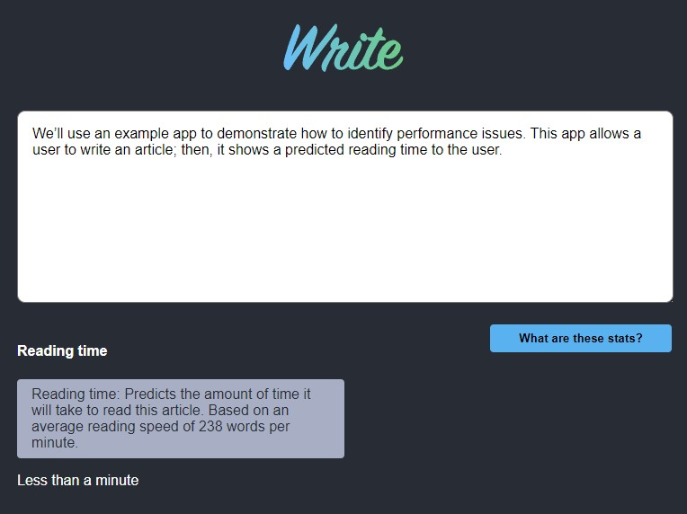

# Profile Video Example(React Profiler)

## Table of contents

- [Overview](#overview)
  - [The challenge](#the-challenge)
  - [Screenshot](#screenshot)
  - [Links](#links)
- [My process](#my-process)
  - [Built with](#built-with)
  - [What I learned](#what-i-learned)
  - [Continued development](#continued-development)
- [Author](#author)

## Overview

### The challenge

Users should be able to:

- View the optimal layout for the app depending on their device's screen size.
- Enter text in the text area.
- The entered text will be measured of how long it would take to read.

### Screenshot

### Links

- Live Site URL: [View](https://profilevideoexamplereactv18.netlify.app/)

## My process

- The React Profiler is a tool that helps developers identify performance bottlenecks in React applications by analyzing component re-renders.
- It records sessions where user interactions occur and displays data related to the commit phase, which is when React updates the DOM.
- To use the Profiler, you install the React Developer Tools extension and access the "Profiler" tab in the browser's developer tools.
- Once you start a recording session, you can perform actions in the app and stop the session to analyze the results.
- The Profiler shows a flame graph with horizontal bars representing components.
- The length of these bars indicates the time each component took to render, with yellow bars showing performance-heavy components.
- By clicking on a component in the graph, you can see details like what triggered the re-render and how long it took.
- To address performance issues, React offers hooks like `useMemo()`, which memoizes expensive calculations, preventing unnecessary re-renders.
- After making performance optimizations, you can use the Profiler again to verify improvements by comparing render times before and after the changes.

### Built with

- Semantic HTML5 markup
- CSS custom properties
- Mobile-Responsive Design
- JavaScript - Scripting language
- [React](https://reactjs.org/) - JS library

### What I learned

This was a class project to learn about react profiler.

### Continued development

maybe use later

## Author

- Website - [Cameron Howze](https://camkol.github.io/)
- Frontend Mentor - [@camkol](https://www.frontendmentor.io/profile/camkol)
- GitHub- [@camkol](https://github.com/camkol)
- LinkedIn - [@cameron-howze](https://www.linkedin.com/in/cameron-howze-28a646109/)
- E-Mail - [cameronhowze4@outlook.com](mailto:cameronhowze4@outlook.com)
